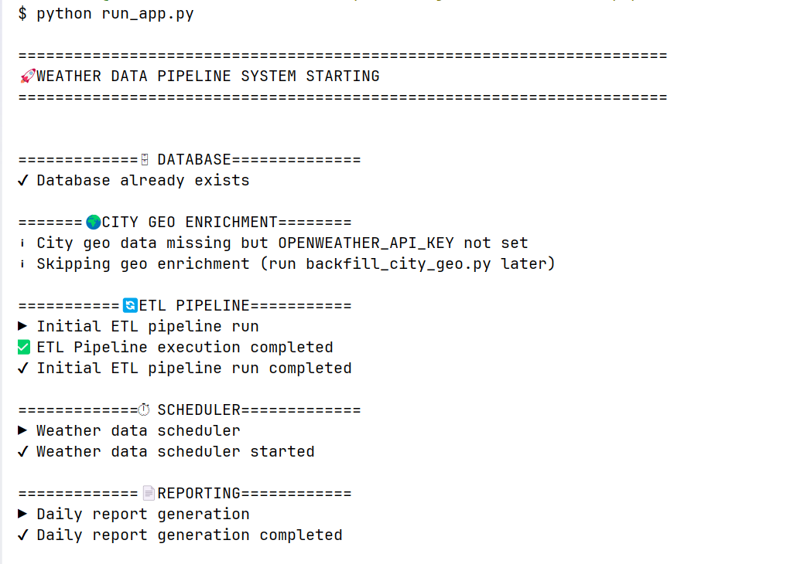
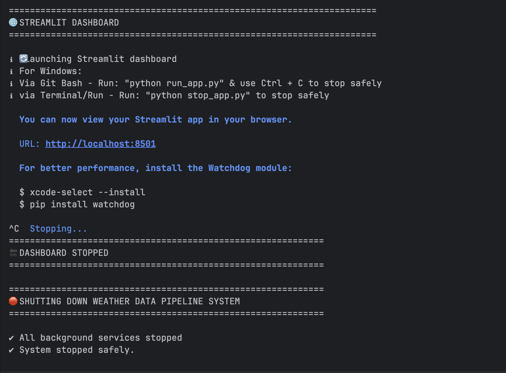
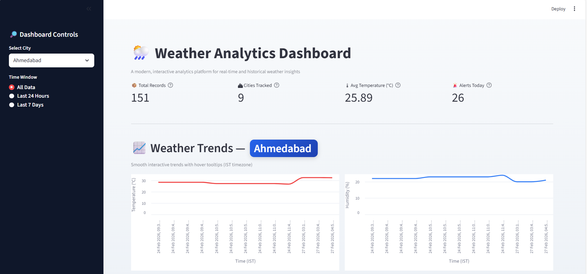
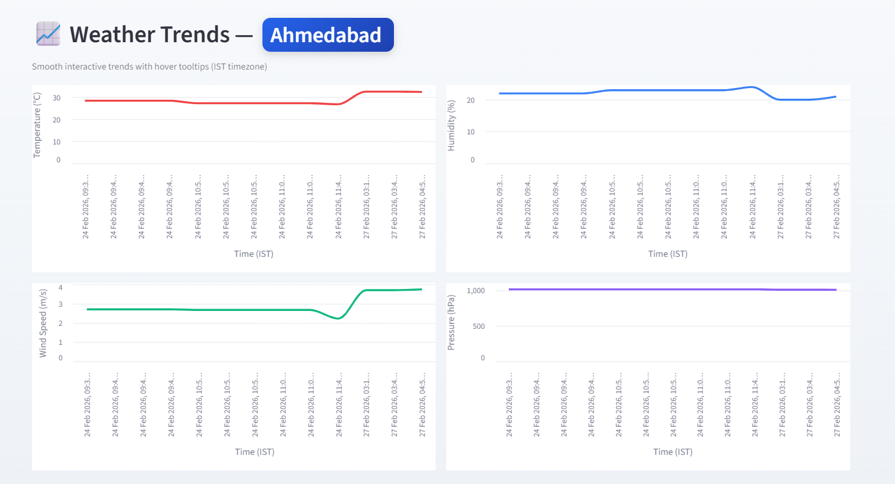
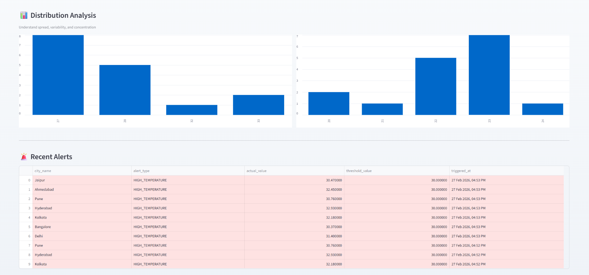
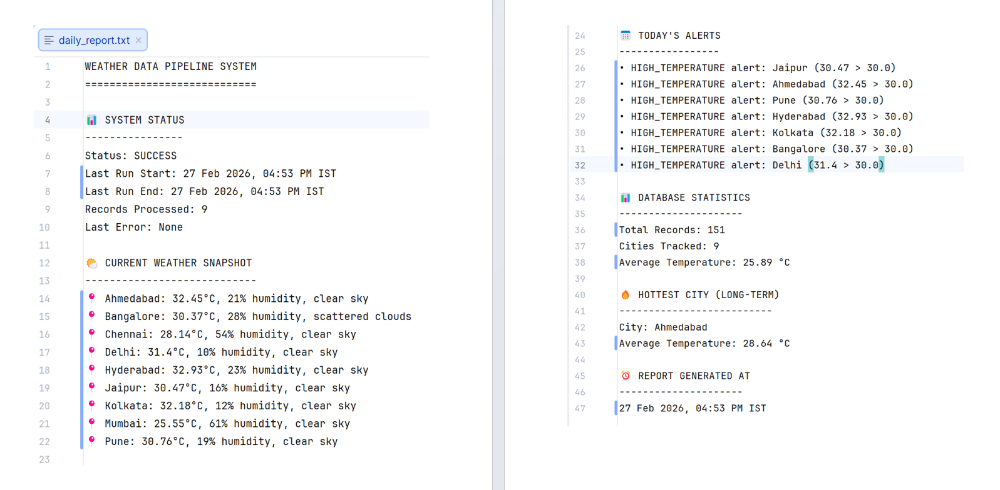
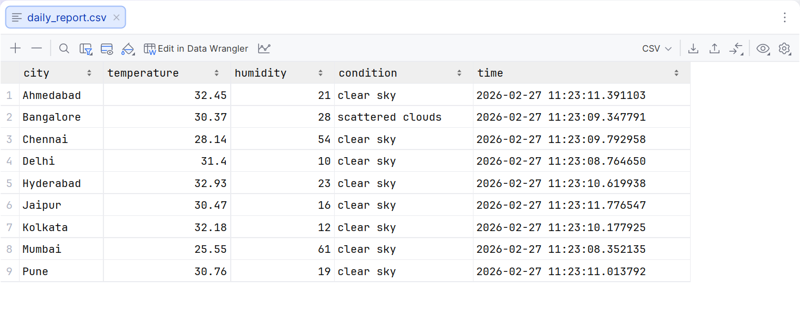
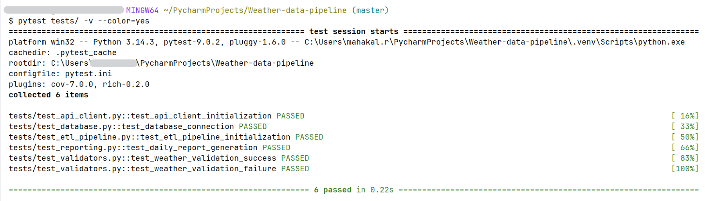

# 🌦️ Weather Data Pipeline System


> An end-to-end automated weather data engineering pipeline with ETL, analytics, reporting, scheduling, and interactive visualization.

---

## 📌 Project Overview

The **Weather Data Pipeline System** is a complete data engineering solution that demonstrates how real-world weather data can be ingested, processed, stored, analyzed, reported, and visualized using Python.

This project is designed to simulate a **production-style data pipeline**, covering the full lifecycle from API ingestion to dashboards and automated execution.

### 🔹 What this project demonstrates

* API data ingestion with retry handling
* ETL pipeline (Extract → Transform → Load)
* Data validation and quality checks
* Relational database design
* Automated scheduling and reporting
* Interactive Streamlit dashboard
* One-command system execution
* Graceful startup and shutdown
* Unit & integration testing
* Professional documentation

---

## 🧱 High-Level Architecture

```text
OpenWeather API
      ↓
API Client (Retries, Validation)
      ↓
ETL Pipeline (Transform + Alerts)
      ↓
SQLite Database
      ↓
Analytics & Reports (TXT / CSV)
      ↓
Streamlit Dashboard
```

📘 Detailed architecture diagrams and explanations are available here:
👉 **docs/documentation.md**

---

## 🚀 Key Features

### 🔄 Data Ingestion

* Fetches real-time weather data from OpenWeather API
* Handles API failures using retry logic
* Uses environment variables for secure API key storage

### 🧪 ETL Pipeline

* Extracts weather data for configured cities
* Validates temperature, humidity, pressure, and wind values
* Transforms raw API response into normalized schema
* Loads clean data into SQLite database
* Generates alerts when thresholds are breached

### 🗄️ Database

* SQLite relational database
* Normalized tables:

  * `cities`
  * `weather_data`
  * `alerts`
  * `pipeline_runs`
* Foreign key relationships enforced

### ⏱️ Automation

* Background scheduler for periodic ETL runs
* Automated daily report generation
* Single command execution (`run_app.py`)
* Safe shutdown using `CTRL+C` or `stop_app.py` (not required if using Git Bash)

### 📄 Reporting

* Daily TXT report (human-readable)
* Daily CSV report (analysis-ready)
* Includes:

  * System status
  * Records processed
  * Alerts summary
  * Long-term insights

### 📊 Dashboard

* Streamlit-based interactive dashboard
* KPI cards
* City-wise trend charts
* Distribution analysis
* Alerts table
* Raw data explorer
* All timestamps shown in **IST**

### 🧪 Testing

* Pytest-based test suite
* Unit and integration tests
* Mocked API tests
* Validation logic tests
* CI-ready structure

---

## 📂 Project Structure

```text
Weather-data-pipeline/
│
├── src/
│   ├── api_client.py
│   ├── etl_pipeline.py
│   ├── scheduler.py
│   ├── reporter.py
│   ├── dashboard.py
│   ├── database.py
│   ├── logger.py
│   ├── alerts.py
│   ├── analytics.py
│   └── validators.py
│
├── scripts/
│   ├── init_db.py
│   ├── run_pipeline.py
│   ├── test_api.py
│   └── backfill_city_geo.py
│
├── database/
│   ├── schema.sql
│   ├── analytics_queries.sql
│   └── weather_data.db
│
├── reports/
│   ├── daily_report.txt
│   └── daily_report.csv
│
├── docs/
│   ├── documentation.md
│   ├── diagrams/
│   └── screenshots/
│
├── tests/
│   ├── test_api_client.py
│   ├── test_database.py
│   ├── test_etl_pipeline.py
│   ├── test_reporting.py
│   └── test_validators.py
│
├── run_app.py
├── stop_app.py
├── requirements.txt
└── README.md
```

---

## ▶️ How to Run the Project (One Command Step-by-Step)

### ✅ Prerequisites

* Python **3.10+**
* OpenWeather API Key
* Internet connection (required for OpenWeather API)

Verify Python version:

```bash
python --version
```

---

### 🔑 Step 1: Get OpenWeather API Key

This project uses **OpenWeather API** for real-time weather data.

#### 1️⃣ Create an OpenWeather Account

1. Go to 👉 [https://openweathermap.org/](https://openweathermap.org/)
2. Sign up / Log in
3. Navigate to **API Keys** section
4. Copy your API key

⚠️ **Note**:
A newly created API key may take **5–10 minutes** to activate.

---

### 🔐 Step 2: Configure API Key (Environment Variable)

The project **does NOT hardcode API keys**.
It reads the API key securely from environment variables.

#### 🔹 Windows (PowerShell)

```powershell
setx OPENWEATHER_API_KEY "your_api_key_here"
```

Restart your terminal after running this.

---

#### 🔹 Windows (Git Bash)

```bash
export OPENWEATHER_API_KEY="your_api_key_here"
```

---

#### 🔹 Linux / macOS

```bash
export OPENWEATHER_API_KEY="your_api_key_here"
```

---

#### ✅ Verify API Key

Run:

```bash
python -c "import os; print(os.getenv('OPENWEATHER_API_KEY'))"
```

You should see your API key printed.

---

### 📦 Step 3: Install Dependencies

Navigate to the project root directory:

```bash
cd Weather-data-pipeline
```

Install required packages:

```bash
pip install -r requirements.txt
```

---

### 🗄️ Step 4: Database Initialization (Automatic)

You **do NOT need to create the database manually**.

When you run the system:

* SQLite database is created automatically
* Tables are initialized
* Schema is applied safely

Database location:

```
database/weather_data.db
```

---

### 🌍 Step 5: City Metadata Seeding (Automatic)

City details (latitude, longitude) are enriched automatically using:

```
scripts/backfill_city_geo.py
```

This runs **internally via `run_app.py`** when:

* Database exists
* Cities are missing geo metadata

You do **NOT** need to run this manually.

---

### 🚀 Step 6: Run the Entire System (One Command)

This is the **recommended and final way** to run the project.

```bash
python run_app.py
```

### What happens internally:

1. ✔ Database validation / initialization
2. ✔ City metadata enrichment (if required)
3. ✔ Initial ETL pipeline run
4. ✔ Scheduler starts (background)
5. ✔ Daily report generation (TXT + CSV)
6. ✔ Streamlit dashboard launches

---

### 🌐 Step 7: Access the Dashboard

After Streamlit starts, you’ll see output like:

```
You can now view your Streamlit app in your browser.

Local URL: http://localhost:8501
Network URL: https://<your-ip>:8501
```

Open the **Local URL** in your browser.

---

### 🛑 Step 8: Stop the System Safely

### Recommended (Safe Shutdown)

Open a new terminal and run:

```bash
python stop_app.py
```

This will:

* Stop scheduler
* Terminate background processes
* Shut down the dashboard cleanly

---

### ⚠️ About Ctrl + C

* Ctrl + C behavior may vary across:

  * Git Bash
  * Windows CMD
  * PowerShell
* **`stop_app.py` is the guaranteed safe method**

---

## 📸 Screenshots & Visual Evidence

### 🖥️ CLI System Startup



---

### 📊 CLI Dashboard startup




---

### 📊 Dashboard Overview




---


### 📈 City-wise Weather Trends




---

### 🚨 Alerts Visualization


---

### 📄 Generated Reports

Generated automatically under:

```
reports/
├── daily_report.txt
└── daily_report.csv
```
---
#### TXT Report





#### CSV Report




Reports include:

* System status
* Records processed
* Alerts summary
* Long-term insights

---

## 🧪 (Optional) Running Tests

Run the complete test suite:

```bash
pytest tests/
```



✔ Unit tests
✔ Integration tests
✔ Validation tests
✔ Mocked API tests

---

## 🧠 Common Issues & Fixes

### ❌ API Unauthorized (401 Error)

**Cause**:

* API key not set
* API key not activated yet

**Fix**:

* Re-check environment variable
* Wait 5–10 minutes after key creation

---

### ❌ “No cities found in database”

**Cause**:

* Database reset without city seeding

**Fix**:

* Re-run `python run_app.py`
* City enrichment runs automatically

---

## 📘 Documentation

All technical documentation is consolidated here:

📄 **docs/documentation.md**

Includes:

* System architecture
* API documentation
* Database schema & ER diagrams
* Execution flow
* Design decisions

---

## 🧠 Design Highlights

* Modular architecture
* Separation of concerns
* OS-friendly execution
* Graceful startup and shutdown
* Production-style automation
* Clean logging and reporting
* Portfolio-ready documentation

---

## 🔮 Future Enhancements

* PostgreSQL / cloud database
* Docker & containerization
* Forecast & historical APIs
* REST API layer
* Authentication for dashboard
* Cloud scheduling (Airflow)

---

## 👤 Author

**Rahul Mahakal**
Python | Data Science | AI/ML Engineer

---

### 🎯 Final Note

This project is designed to reflect **real-world data engineering practices**, not just academic examples.
It can be **extended, deployed, and discussed confidently** in professional settings.

---