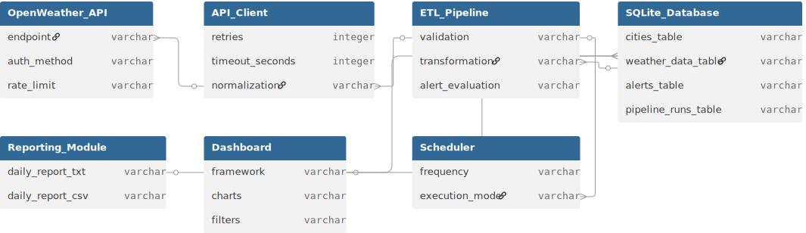
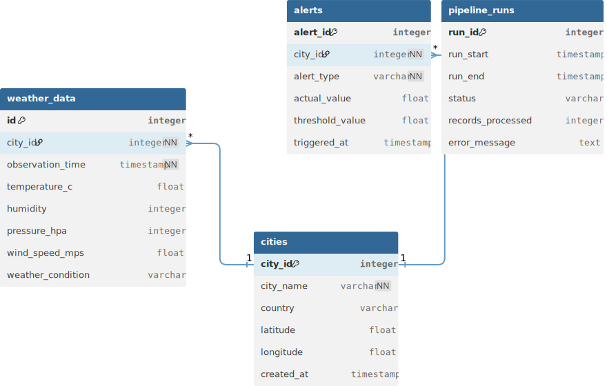

<h1 align="center">Weather Data Pipeline</h1>

# System Architecture
## 1. Introduction

The **Weather Data Pipeline System** is an end-to-end data engineering solution designed to ingest, validate, store, analyze, and visualize real-time and historical weather data.

The system emphasizes:
- Modularity
- Automation
- Fault tolerance
- OS-agnostic execution

This document describes the overall architecture, execution flow, design decisions, and scalability considerations.

---

## 2. Architectural Principles

The system follows these core principles:

- Separation of Concerns
- Single Responsibility
- Loose Coupling
- Fail-Safe Defaults
- Testability
- Automation-First Design

---

## 3. High-Level Architecture

The Weather Data Pipeline follows a layered architecture that separates ingestion,
processing, persistence, analytics, and visualization responsibilities.

<p align="center">
  
</p>

```
┌─────────────────────────────┐
│ External Data Source │
│ OpenWeather API │
└──────────────┬──────────────┘
│
▼
┌─────────────────────────────┐
│ API Client Layer │
│ api_client.py │
│ • Retry logic │
│ • Error handling │
│ • Data normalization │
└──────────────┬──────────────┘
│
▼
┌─────────────────────────────┐
│ ETL Processing Layer │
│ etl_pipeline.py │
│ • Validation │
│ • Transformation │
│ • Alert evaluation │
└──────────────┬──────────────┘
│
▼
┌─────────────────────────────┐
│ Persistence Layer │
│ SQLite Database │
│ weather_data.db │
└──────────────┬──────────────┘
│
▼
┌─────────────────────────────┐
│ Analytics & Reporting │
│ reporter.py │
│ analytics SQL queries │
└──────────────┬──────────────┘
│
▼
┌─────────────────────────────┐
│ Visualization Layer │
│ Streamlit Dashboard │
│ dashboard.py │
└─────────────────────────────┘
```

---

## 4. Execution Flow

### Primary Entry Point: `run_app.py`

Execution sequence:
1. Validate environment and paths
2. Initialize database (if missing)
3. Seed and enrich city metadata
4. Execute initial ETL run
5. Start background scheduler
6. Generate daily report
7. Launch Streamlit dashboard
8. Handle graceful shutdown

---

## 5. Scheduling & Automation

- Implemented via `scheduler.py`
- Runs as a background process
- Periodically triggers ETL jobs
- Does not block dashboard execution

---

## 6. Error Handling Strategy

| Layer        | Strategy                          |
|--------------|-----------------------------------|
| API Client   | Retry, timeout, HTTP validation   |
| ETL          | Data validation and safe skipping |
| Database     | Transaction safety                |
| Scheduler    | Non-blocking execution            |
| Orchestrator | Graceful termination              |

---

## 7. OS Compatibility

The system is fully OS-agnostic and runs on:
- Windows (PowerShell / Git Bash)
- Linux
- macOS

No OS-specific dependencies are hard-coded.

---

## 8. Scalability & Future Enhancements

- Replace SQLite with PostgreSQL
- Introduce REST API layer
- Containerize using Docker
- Integrate workflow orchestration (Airflow)

---

## 9. Summary

This architecture ensures:
- Reliability
- Maintainability
- Extensibility
- Production readiness


# API Documentation

## 1. Overview

The Weather Data Pipeline consumes weather data from an external provider and abstracts it through an internal API client.  
This abstraction ensures **reliability**, **consistency**, **testability**, and **security** across the system.

---

## 2. External API – OpenWeather

### 2.1 Endpoint
```
GET https://api.openweathermap.org/data/2.5/weather
```

---

### 2.2 Query Parameters

| Parameter | Type   | Required | Description            |
|-----------|--------|----------|------------------------|
| q         | string | Yes      | City name              |
| appid     | string | Yes      | API key                |
| units     | string | No       | Unit system (`metric`) |

---

### 2.3 Example Request
```
https://api.openweathermap.org/data/2.5/weather?q=Delhi&appid=API_KEY&units=metric
```


---

## 3. Internal API Abstraction

### 3.1 WeatherAPIClient

**File:** `src/api_client.py`

#### Method Signature

```
fetch_weather(city_name: str) -> dict | None
```

### 3.2 Responsibilities

- Send HTTP requests to OpenWeather
- Retry failed calls (max 3 attempts)
- Handle timeouts and HTTP errors
- Normalize API response
- Return structured weather 


### 4. Normalized Response Schema
```
</> JSON
{
  "temperature_c": 29.4,
  "humidity": 68,
  "pressure_hpa": 1013,
  "wind_speed_mps": 3.2,
  "weather_condition": "clear sky",
  "observation_time": "2026-02-18T10:30:00Z"
}
```
### 5. Error Handling Strategy
Scenario	Behavior
401 Unauthorized	Abort after retries
404 City not found	Skip city
Timeout	Retry
Invalid payload	Validation failure

| Scenario           | Type                |
|--------------------|---------------------|
| 401 Unauthorized   | Abort after retries |
| 404 City not found | Skip city           |
| Timeout            | Retry               |
| Invalid payload    | Validation failure  |

### 6. Security Considerations

- API key is read from environment variables
- API keys are never hard-coded
- Safe for CI/CD and open-source sharing

### 7. Extension Points

- Weather forecast endpoints
- Geolocation-based queries
- Rate-limit monitoring

### 8. Summary

The API layer provides a reliable and extensible foundation for weather data ingestion while isolating external dependencies from the core pipeline.


# Database Design

## 1. Overview

The system uses **SQLite** as its relational database engine to store structured weather observations, metadata, alerts, and pipeline execution history.

**Database file:**  
`database/weather_data.db`

---

## 2. Entity Relationship Diagram (ERD)

The following diagram illustrates the relationships between database tables
used in the Weather Data Pipeline system.

<p align="center">
  
</p>

```
cities ───────< weather_data
│
└─────────< alerts

pipeline_runs (independent)
```

---

## 3. Tables & Schemas

---

### 3.1 cities

Stores metadata for each tracked city.

| Column    | Type         | Description            |
|-----------|--------------|------------------------|
| city_id   | INTEGER (PK) | Unique city identifier |
| city_name | TEXT         | City name              |
| latitude  | REAL         | Latitude               |
| longitude | REAL         | Longitude              |
| country   | TEXT         | Country code           |

---

### 3.2 weather_data

Stores historical weather observations.

| Column            | Type         | Description          |
|-------------------|--------------|----------------------|
| id                | INTEGER (PK) | Record ID            |
| city_id           | INTEGER (FK) | Reference to cities  |
| observation_time  | TIMESTAMP    | UTC timestamp        |
| temperature_c     | REAL         | Temperature (°C)     |
| humidity          | INTEGER      | Humidity (%)         |
| pressure_hpa      | INTEGER      | Atmospheric pressure |
| wind_speed_mps    | REAL         | Wind speed           |
| weather_condition | TEXT         | Weather description  |

---

### 3.3 alerts

Stores threshold-based alerts.

| Column          | Type         | Description         |
|-----------------|--------------|---------------------|
| alert_id        | INTEGER (PK) | Alert ID            |
| city_id         | INTEGER (FK) | Reference to cities |
| alert_type      | TEXT         | Alert category      |
| actual_value    | REAL         | Observed value      |
| threshold_value | REAL         | Threshold           |
| triggered_at    | TIMESTAMP    | Trigger timestamp   |

---

### 3.4 pipeline_runs

Tracks ETL pipeline execution history.

| Column            | Type         | Description       |
|-------------------|--------------|-------------------|
| run_id            | INTEGER (PK) | Run identifier    |
| run_start         | TIMESTAMP    | Pipeline start    |
| run_end           | TIMESTAMP    | Pipeline end      |
| status            | TEXT         | SUCCESS / FAILED  |
| records_processed | INTEGER      | Number of records |
| error_message     | TEXT         | Failure details   |

---

## 4. Constraints & Data Integrity

- Foreign key constraints enforced
- Cities auto-created when missing
- Alerts generated only on threshold breach

---

## 5. Indexing Strategy

- Primary keys indexed automatically
- Foreign keys ensure referential integrity

---

## 6. Future Enhancements

- Index `observation_time`
- Partition large tables
- Migrate to PostgreSQL for scale

---

## 7. Summary

The database schema is normalized, scalable, and optimized for analytics and reporting workloads.